Scratch is the simplest and easiest way to start programming your Marty,
if you're new to programming. The interface lets you graphically build up
a program from blocks.
{:.feature}

<a href="http://scratch3beta.robotical.io" class="btn rounded" target="_blank"><i class="fa fa-external-link"></i> &nbsp; Click to open Scratch &times; Marty</a>

Scratch needs to connect to Marty over your WiFi network to send instructions, so Marty must be on your WiFi network. If you haven't already, then check out the [WiFi setup guide](https://robotical.io/learn/article/Marty%20Setup%2C%20Calibration%20%26%20Troubleshooting%20Guide/WiFi%20Setup)

When you open Scratch, it'll try and find Martys on your network. Have a look at the [Scratch getting started guide](https://robotical.io/blog/article/8/Marty%20Scratch%203%20Extension%20-%20beta) for details on how that works.

<a href="https://robotical.io/blog/article/8/Marty%20Scratch%203%20Extension%20-%20beta/" class="btn rounded" target="_blank"><i class="fa fa-external-link"></i> &nbsp; Getting started with Scratch</a>

&nbsp;&nbsp;
<!--
TODO: LINK TO TUTORIALS / LEARNING MATERIALS ETC.
-->

## Useful info

It's also worth checking out the [Intro to Marty Behaviour](/learn/article/Intro%20to%20Marty%20Behaviour/Introduction) article for details on how Marty behaves and reacts. But in brief

 * Marty's motors are turned off by default, they're enabled using the `Get Ready` block (which will also move Marty to the zero position), or the `Enable motors` block.
 * Fall protection will turn off Marty's motors if it looks like Marty is falling over
 * Motor over-current protection will deactivate a motor if it gets a large instantaneous load, or a sustained heavy load
 * Buzz prevention will try to reduce the torque on Marty's motors when movements are finished - so Marty might move a little bit to get comfy. It'll also let you move his motors (except for the eyes) by hand, if you push gently.

## Function Reference

This section will give details on each block available through the Scratch interface.

| Action Blocks                     | Sensor Blocks                      |
|:----------------------------------|:-----------------------------------|
| [Circle dance](#circle_dance)     | [Accelerometer](#accelerometer)    |
| [Turn on motors](#enable_motors)   | [Battery Voltage](#battery_voltage)|
| [Eyes](#eyes)                     | [Input](#input)                    |
| [Get Ready](#get_ready)           | [Motor current](#motor_current)    |
| [Kick](#kick)                     | [Proximity](#proximity)            |
| [Lean](#lean)                     |                                    |
| [Lift leg](#lift_leg)             |                                    |
| [Lower leg](#lower_leg)           |                                    |
| [Move joint](#move_joint)         |                                    |
| [Move leg forward/backward](#move_leg_forward) |                       |
| [Play sound](#play_sound)         |                                    |
| [Set blocking mode](#set_blocking_mode) |                              |
| [Slide](#slide)                   |                                    |
| [Stand straight](#stand_straight) |                                    |
| [Stop](#stop)                     |                                    |
| [Turn](#turn)                     |                                    |
| [Turn off motors](#turn_off_motors) |                                  |
| [Walk](#walk)                     |                                    |
| [Walk backward](#walk_backward)   |                                    |
| [Walk forward](#walk_forward)     |                                    |
| [Wiggle](#wiggle)                 |                                    |
{:.tt}

### Action Blocks

#### Circle Dance 

 

`Circle dance` will make Marty lean right->forward->left->backward, or left->backward->right->forward, depending on the setting. His head will therefore move round in a clockwise or anticlockwise direction.

The time is for a complete cycle.

The movement will end with Marty leaning either forward or backward, so you can send several `circle dance` commands in a row to produce a continuous motion

#### Turn on motors 
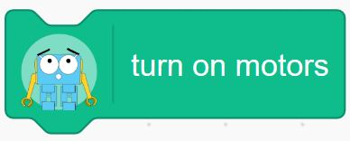

`Turn on motors` will activate Marty's motors so they're ready to receive commands, but won't send any movement commands.

`Turn on motors` will also un-pause any queued movements, so if you've previously used the [`stop and pause`](#stop) block, you can use `enable motors` to resume movement.

#### Eyes 

The `Eyes` block will let you move Marty's eyebrows near-instantly to a predefined position - either *angry*, *normal*, *excited*, or *wide*

#### Get Ready 

The `Get ready` block is designed to get Marty's motors activated and finish with all joints in their zero positions. It'll also wiggle the eyebrows, so you know that it's done something even if Marty was already standing straight.

It will [`turn on motors`](#enable_motors)

It's a good idea to call this at the beginning of a script, to make sure Marty's joints are enabled and in a known position. 

When Marty's motors have been deactivated, he has no way to tell where they are. So **when you call `Get ready` Marty may move very quickly** and jerk a bit. Keep fingers clear!

#### Kick 

`Kick` will make a kicking movement with Marty's right or left legs.

#### Lean 

Lean will make Marty lean forward, backward, left or right, in the given number of seconds. 

Forwards and backwards will move Marty's hip joints together, while left and right will move Marty's knee joints.

#### Lift leg 
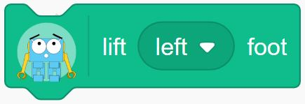

`Lift leg` will move either Marty's left or right knee outward to lift that leg up. This might make Marty tilt sideways, depending on his current position

#### Lower leg 
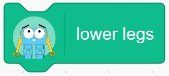

`Lower leg` will measure which of the two knees is higher up, and then lower it to the same angle as the lower knee. This will have the effect of lowering a raised leg to the ground.

This function currently doesn't take into account hip angles, so you might get unexpected behaviour if the hip angles don't have the same magnitude.

#### Move joint 

`Move joint` will move a single one of Marty's joints to a specified angle in a specified time.

The angle is given as a percentage of max for that joint.

By default queuing up `move joint` blocks will make the movements happen sequentially, one after the other. If you want to tell multiple joints to move simultaneously, you can disable blocking using the [set blocking mode](#set_blocking_mode) block.

#### Move leg forward/backward 

The `Move leg` block will move either the left or right leg forwards or backwards, by moving the hip joint.

> Note that forward or backward is relative to Marty - so moving a leg backwards can move the rest of Marty forwards!

#### Play sound 
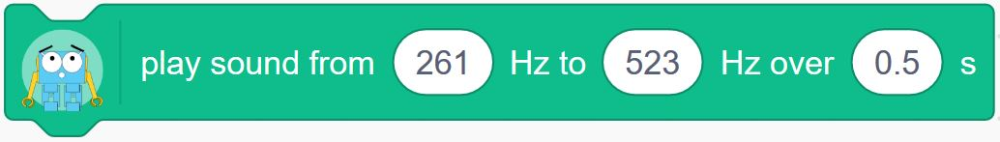

This block will make Marty's buzzer make a noise. It takes three parameters, the starting frequency, end frequency, and the duration. The frequency of the output will be linearly moved between the start and end frequencies, so you can make chirps. You can also set the start frequency and end frequency to be the same to generate single tones.

Marty will queue up multiple sound commands, so you can send whole tunes across to be played. 

The play sound block will return straight away (it won't pause operation while the sound is played).

#### Set blocking mode 

The `Set blocking mode` block affects the operation of all other movement blocks. 

By default, blocking is enabled - and that means that a movement block (like a walk or move joint block) will take the same time to execute as the movement takes. So if you say to lean left in two seconds, that block will take two seconds to finish, before the next block is executed.

However, if blocking is disabled, movement commands will be sent to Marty, but operation will continue immediately.

This is most useful if you want to combine movements. For example, if you had three move joint blocks in a row like this:

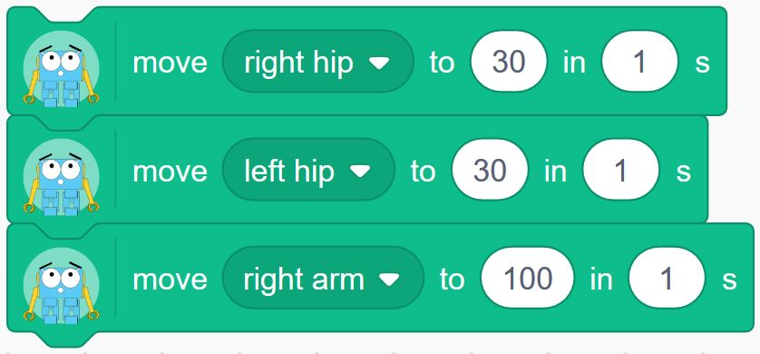

With blocking *enabled*, Marty would move the right hip, then the left hip, then the arm.
With blocking *disabled*, Marty would move all three joints near simultaneously.

If timing is really really critical, you might want to pause operation, queue up some movements on Marty, and then set them all off at the same time, like this:

That'll avoid any slight timing differences due to network lag.

#### Slide 

`Slide` will make Marty take a specified number of slides to the left or right. 

It defaults to a direction of left, a step time of 1.5s and a step length of length of 50. 

For more information on the step parameters see the [walk](#walk) function.

#### Stand straight 

`Stand straight` will return all of Marty's joints (including the eyes and the arms) to their zero positions.

It'll move them simultaneously over 2 seconds.

#### Stop 

Stop will let you stop or pause the movements of a Marty. It's especially useful in [non-blocking mode](#set_blocking_mode)

There are several options types of stop:

| Stop type                | Effect                                                                 |
|:-------------------------|:-----------------------------------------------------------------------|
| finish move              | Clear movement queue only (so finish the current step/wiggle/movement) |
| freeze                   | Clear movement queue and servo queues (freeze where you are)           |
| disable motors           | Clear everything and disable motors                                    |
| return to zero           | Clear everything, and make robot return to zero                        |
| pause                    | Pause, but keep servo and movequeue intact and motors enabled          |
| pause and disable motors | As pause, but disable motors too                                       |
{:.tt}

#### Turn 
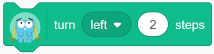

Turn will make Marty turn on the spot in the left or right direction. For faster turning try using the [walk block](#walk) to set your own parameters

#### Turn off motors 
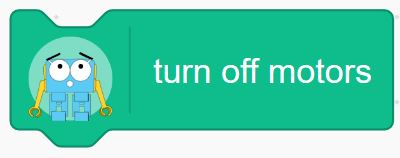

The `Turn off motors` block will disable all of Marty's servos. That'll make them moveable by hand, and you'll need to re-enable them with an [`enable motors`](#enable_motors) or [`Get ready`](#get_ready) block before they'll move again

#### Walk 

The `walk` block lets you set specific parameters for walking. 

The step length is a percentage of maximum, from -100 to +100. Negative step sizes will make Marty walk backwards.

Turn is also a percentage of maximum.

Step time is in seconds, down to a minimum of 0.5s.

#### Walk backward 

This block will make Marty take a specified number of steps backwards. It defaults to a step length of -40 and a step time of 1.8 seconds.

#### Walk forward 

This  block will make Marty take a specified number of steps forwards. It defaults to a step length of 40 and a step time of 1.8 seconds.

#### Wiggle 

This'll make Marty wiggle.

### Sensor blocks

#### Accelerometer (tilt sensing) 

The `accelerometer` block lets you read from Marty's three axis accelerometer. This can tell you information about acceleration, but also about tilt.

There are three axes:

| Axis       | Marty dimension             |
|:-----------|:----------------------------|
| Z-axis     | Vertical                    |
| Y-axis     |                             |
| X-axis     |                             |

Each axis will give a number representing the acceleration in that direction, but will also show the direction gravity is pulling. That's because accelerometers are basically little weights attached to springs, and while acceleration causes the weights to move, so does gravity.

When Marty is standing straight and not moving, the Z-axis should read around 1.0. 

The Z-axis of the accelerometer is also used for fall detection.

To measure tilt, you could try doing something like this:

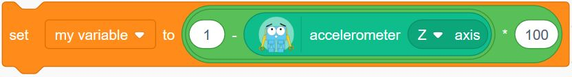

That'll set tilt to around 0 normally, going up to 100 if Marty is horizontal. You could also use the X and/or Y axis to measure tilt in a particular direction

#### Battery Voltage 

This block will tell you Marty's battery voltage, which can be pretty useful to let you know when you should recharge.

It gives back the actual voltage. About 8.4 is fully charged, and 7.4 is getting low.

#### Input 

The `input` block reads one of Marty's GPIO channels.

For example, you can connect a bump switch to one of the channels, and the input block will return with a 1 if it's pressed, or a 0 otherwise.

The ports are labelled on Marty's control board, and bump switches connect up the same way as the motors do, with the white cable at the top

<!-- TODO: graphic of connecting bump switch -->

So, to wait until a switch connected to port 0 is pressed you could do:

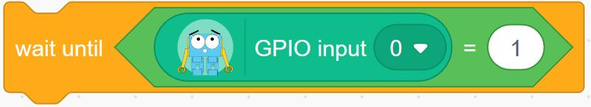

#### Motor current 

The `motor current` block lets you read the electrical current going through one of the motors. That gives an estimate of the force on the motor.

It's normally a very small number, so it might be easier to multiply it. To react to somebody pressing Marty's arm, you could do this:

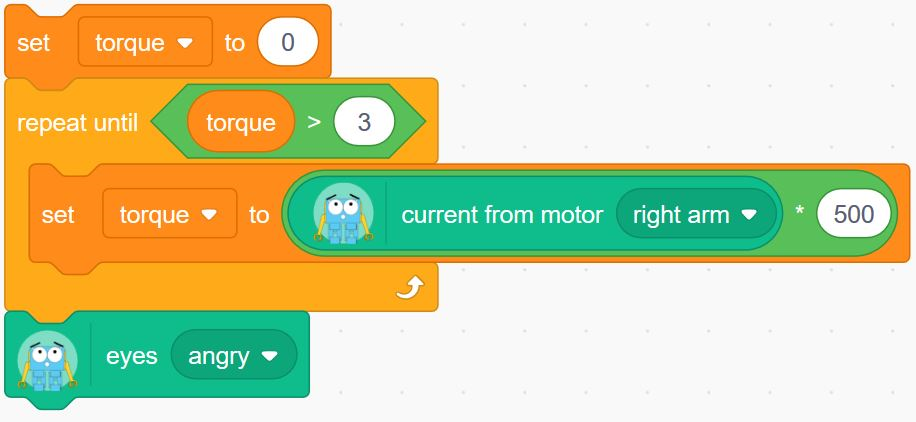

#### Proximity 

The `proximity` block lets you read the distance sensor. It returns a reading in mm which may be slightly off the real distance. 

To have Marty Stop when getting close to an object you could do this:

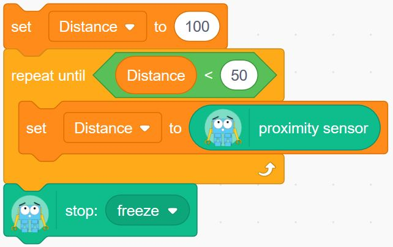

<!-- table of blocks with links -->
<!-- how to read a sensor -->

