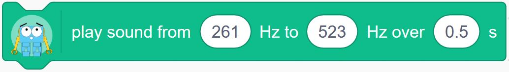
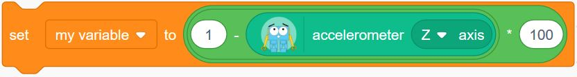
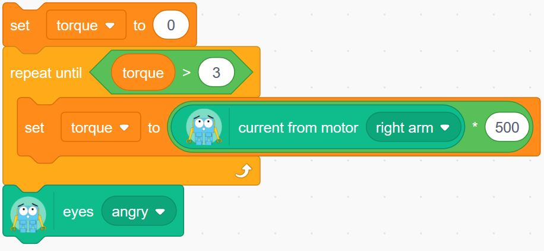

如果您不熟悉編寫程式，Scratch是對Marty進行編程的一個最簡單開始。 該界面使您可以從方塊模組和圖形的方式來構建程式。
{:.feature}

<a href="http://scratch3beta.robotical.io" class="btn rounded" target="_blank"><i class="fa fa-external-link"></i> &nbsp; 按此開啟Scratch 3 &times; Marty</a>

Scratch需要通過您的無線網絡（Wi-Fi）連接到Marty才能發送指令，因此Marty必須在您的Wi-Fi網絡中。 如果您沒有準備好，請查看[看Wi-Fi設置指南](https://robotical.io/learn/article/Marty%20Setup%2C%20Calibration%20%26%20Troubleshooting%20Guide/WiFi%20Setup)

當您打開Scratch時，它將會嘗試在您的網絡中尋找Marty。 請參閱 [Scratch入門指南](https://robotical.io/blog/article/8/Marty%20Scratch%203%20Extension%20-%20beta) 以詳細了解其運作原理。

<a href="https://robotical.io/blog/article/8/Marty%20Scratch%203%20Extension%20-%20beta/" class="btn rounded" target="_blank"><i class="fa fa-external-link"></i> &nbsp; 在此開始Scratch</a>

&nbsp;&nbsp;
<!--
TODO: LINK TO TUTORIALS / LEARNING MATERIALS ETC.
-->

## 實用資訊

我們還推薦你查看關於 [Marty的行為簡介](/learn/article/Intro%20to%20Marty%20Behaviour/Introduction) 的行為簡介以詳細了解Marty的行為和回應方式。概括而言：

 * 在默認情況下，Marty的馬達處於關閉狀態時，可以使用 `準備就緒` 方塊（會將Marty移至位置零）或使用`啟動馬達` 方塊來啟動它們。
 * 如果Marty跌倒，摔倒保護裝置會將Marty的馬達關閉。
 * 如果馬達在瞬間或持續地承受過大的負荷，馬達的電流保護功能將使馬達暫時失效。
 * 在行動結束後，微震動防禦會嘗試減少Marty馬達產生的作用力，因此，Marty可能會自行移動來調節。 如果輕輕推動，它還可以讓您手動移動他的馬達（眼睛除外）。

## 功能參考

本節將詳細介紹通過Scratch界面可用的每個方塊模組。

| 行動方塊                                                                        | 感應器方塊                           |
|:-------------------------------------------------------------------------------|:-----------------------------------|
| [圓圈舞蹈](#circle_dance) [Circle dance](#circle_dance)                          | [重力感應](#accelerometer) [Accelerometer](#accelerometer)   |
| [啟動馬達](#enable_motors) [Turn on motors](#enable_motors)                      | [電池電壓](#battery_voltage) [Battery Voltage](#battery_voltage)|
| [眼睛](#eyes) [Eyes](#eyes)                                                     | [輸入](#input) [Input](#input)                    |
| [準備就緒](#get_ready) [Get Ready](#get_ready)                                   | [馬達電流](#motor_current) [Motor current](#motor_current)    |
| [踢](#kick) [Kick](#kick)                                                       | [距離感應](#proximity) [Proximity](#proximity)           |
| [靠倚](#lean) [Lean](#lean)                                                     |                                    |
| [抬腿](#lift_leg) [Lift leg](#lift_leg)                                         |                                    |
| [小腿](#lower_leg) [Lower leg](#lower_leg)                                      |                                    |
| [移動關節](#move_joint) [Move joint](#move_joint)                                |                                    |
| [向前/向後移腿](#move_leg_forward) [Move leg forward/backward](#move_leg_forward) |                       |
| [播放聲效](#play_sound) [Play sound](#play_sound)                                |                                    |
| [設定鎖定模式](#set_blocking_mode) [Set blocking mode](#set_blocking_mode)        |                              |
| [滑行](#slide) [Slide](#slide)                                                   |                                    |
| [站直](#stand_straight) [Stand straight](#stand_straight)                        |                                    |
| [停止](#stop) [Stop](#stop)                                                      |                                    |
| [轉向](#turn) [Turn](#turn)                                                      |                                    |
| [關閉馬達](#turn_off_motors) [Turn off motors](#turn_off_motors)                  |                                  |
| [步行](#walk) [Walk](#walk)                                                      |                                    |
| [向後步行](#walk_backward) [Walk backward](#walk_backward)                        |                                    |
| [向前步行](#walk_forward) [Walk forward](#walk_forward)                           |                                    |
| [擺動](#wiggle) [Wiggle](#wiggle)                                                |                                    |
{:.tt}

### 行動方塊 Action Blocks

#### 圓圈舞蹈 Circle Dance

 

根據設置，`圓圈舞蹈` 會使Marty向右->向前->向左->向後傾，或向左->向後->向右->向後傾。 因此，他的頭將沿順時針或逆時針方向移動。

完整周期的長短能用時間來調教。

這動作將以Marty向前或向後傾斜而結束，因此您可以連續發送幾個圓圈舞蹈指令以另其不停地的運動。

#### 啟動馬達 Turn on motors

`啟動馬達` 會激活Marty的馬達，以便它們準備接收指令，但不會發送任何運作指令。

`啟動馬達` 也會恢復被暫停和在列隊中的動作，因此，如果您以前使用過 [`停止和暫停`](#stop) 方塊， 則可以使用 `啟動馬達` 來恢復運作。

#### 眼睛 Eyes

`眼睛` 方塊可讓您立即將Marty的眉毛移動到預定的位置：*生氣*、*正常*、*興奮*或*寬闊*。

#### 準備就緒 Get Ready

`準備就緒` 方塊旨在激活Marty的馬達，完成時，Marty的所有關節位置會處於零的狀態。 Marty會擺動一下眉毛來通知您它已經準備就緒，即使Marty一開始已經站直了。

這將會[`啟動馬達`](#enable_motors)

在程式腳本開始時使用此功能是一個不錯的選擇，這可以確保Marty的關節處於啟動狀態並且處於已知的位置。

當停用Marty的馬達後，Marty將無法得知它們的位置。 因此，**當您使用`準備就緒`時，Marty可能會快速移動和猛力地跳一下**。 記得手指要保持距離！

#### 踢 Kick

`踢` 將用Marty的右腳或左腳踢腿。

#### 靠倚 Lean

`靠倚` 可使Marty在指定的秒數內向前，向後，向左或向右傾斜。

向前和向後將移動Marty的髖關節，而向左和向右將移動Marty的膝蓋關節。

#### 抬腿 Lift leg

`抬腿` 可以將Marty的左膝或右膝向外移動以抬起該腿。 這可能會使Marty側身傾斜，具體取決於它當前的位置。

#### 小腿 Lower leg

`小腿` 將測量兩個膝蓋中哪個較高，然後將其降低到與較低的膝蓋相同的角度。 這樣可以將抬高的腳放到地面上。

這功能當前未考慮髖部角度，因此，如果髖部角度大小不同，您可能會遇到意外情況。

#### 移動關節 Move joint

`移動關節` 會將Marty一系列關節中的一個關節在指定時間內移動到指定角度。

角度以該關節的最大百分比表示。

默認情況下，把 `移動關節` 方塊放到動作列隊中將使行動順序進行，一個接一個。如果要多個關節同時移動， 可以使用 [`設定鎖定模式`](#set_blocking_mode) 方塊來禁用鎖定。

#### 向前/向後移腿 Move leg forward/backward

通過移動髖關節， `向前/向後移腿` 方塊將使左腿或右腿向前或向後移動。

> 請注意，向前或向後相對於Marty。因此，向後移動腿部可使Marty的其餘部分向前移動！

#### 播放聲效 Play sound 

這方塊會使Marty的蜂鳴器發出聲音。 它包含三個參數，開始頻率、結束頻率和持續時間。 輸出頻率將是開始頻率和結束頻率之間的線性移動，因此可以進行線性調頻。 您還可以將開始頻率和結束頻率設置為相同，以產生單一音效。

Marty將把多個聲效指令放到列隊中，因此您可以發送整首樂曲進行播放。

`播放聲效`方塊將直接完成操作（播放聲效時不會暫停操作）。

#### 設定鎖定模式 Set blocking mode

`設定鎖定模式` 方塊會影響所有其他行動方塊的運作。 

默認情況下，鎖定模式處於啟用狀態，這意味著行動方塊（如步行或移動關節方塊）將花費與行動相同的時間來執行。 因此，如果您說要在兩秒鐘內向左傾斜，則該方塊將需要兩秒鐘才能完成，然後執行下一個方塊。

但是，如果禁用了鎖定功能，行動指令將發送到Marty，操作將立即繼續。

這是非常有用於組合動作。 例如，如果您連續有三個移動關節方塊如下所示：

*啟用*鎖定功能後，Marty將先移動右臀部，然後移動左臀部，然後移動手臂。 
*禁用*鎖定後，Marty將同時移動所有三個關節。

如果行動時間很關鍵，則可能要暫停操作，將Marty上的某些動作放到列隊中，然後同時將它們全部關閉，如下所示：

這樣可以避免由於網絡延遲而造成的行動時間上的細微差異。

#### 滑行 Slide

`滑行` 將使Marty用指定數字向左或向右滑行。 

默認為向左滑行，時間為1.5秒，踏步為50。

有關步長參數的更多信息，請參見步行 [`步行`](#walk) 功能。

#### 站直 Stand straight

`站直` 將使Marty的所有關節（包括眼睛和手臂）恢復到位置零。

它將在2秒內同時移動它們。

#### 停止 Stop

`停止` 將使您停止或暫停Marty的動作。 在 [非鎖定模式](#set_blocking_mode)下特別有用

不同的停止選擇：

| 停止的種類                            | 效果                                                                   |
|:------------------------------------|:-----------------------------------------------------------------------|
| 完成動作 finish move                  | 清除動作列隊（完成當前步行/擺動/移動）                                       |
| 凍結 freeze                          | 清除動作列隊和伺服馬達列隊（凍結您所在的位置）                                 |
| 停用馬達 disable motors               | 清除所有內容並停用馬達                                                     |
| 歸零 return to zero                   | 清除所有內容，並使機械人歸零                                               |
| 暫停 pause                            | 暫停，但保持伺服馬達和行動列隊完好無損並保持啟動馬達                           |
| 暫停並停用馬達 pause and disable motors | 作為暫停，但也停用馬達                                                    |
{:.tt}

#### 轉向 Turn 

`轉向` 會使Marty向左或向右轉。 為了更快地轉向，請嘗試使用步行（Walk）方塊設置您自己的參數。

#### 關閉馬達 Turn off motors 

`關閉馬達` 將禁用所有Marty伺服馬達系統。 這樣一來，它們便可以手動移動，而您需要使用 [`啟動馬達`](#enable_motors) 或 [`準備就緒`](#get_ready) 方塊重新啟動它們，它們才能再次移動

#### 步行 Walk 

`步行` 方塊可讓您設置步行的特定參數。

步長是最大值的百分比，從-100到+100。 負踏步會使Marty向後行走。

轉向也是最大百分比。

踏步時間以秒為單位，最短為0.5秒。

#### 向後步行 Walk backward 

此方塊將使Marty向後行走指定數量的腳步。 它的默認踏步為-40，時間為1.8秒。

#### 向前步行 Walk forward 

這方塊將使Marty前進行走指定數量的腳步。 它的默認踏步為40，時間為1.8秒。

#### 擺動 Wiggle 

這會讓Marty擺動。

### 感應器方塊 Sensor blocks

#### 重力感應（傾斜感應）Accelerometer (tilt sensing) 

`重力感應` 方塊使您可以從Marty的三軸重力計中進行讀取。 這可以告訴您有關重力的信息，也可以告訴您有關傾斜的信息。

一共有三個軸：

| 軸      | Marty的尺寸             |
|:------- |:-----------------------|
| Z軸     | 垂直                    |
| Y軸     |                        |
| X軸     |                        |

每個軸將給出一個數字表示該方向上的重力度，但也將顯示引力的方向。 那是因為重力計基本上沒有固定砝碼安裝在彈簧上，重力會導致砝碼移動，而引力也會移動。

當Marty站直且不動時，Z軸的讀數應為1.0。 

重力計的Z軸也用於跌倒檢測。

要測量傾斜度，您可以嘗試執行以下操作：

通常會將傾斜度設置為大約0，如果Marty是水平的，則將傾斜度設置為100。 您還可以使用X和/或Y軸來測量特定方向的傾斜度。

#### 電池電壓 Battery Voltage 

這個方塊會告訴您Marty的電池電壓，這對通知您何時應該充電非常有用。

它會告知實際電壓。充滿時大約為8.4，而讀數是7.4時，代表電量逐漸變低。

#### 輸入 Input 

`輸入` 方塊讀取Marty的一個GPIO通道。

例如，您可以將一個緩沖開關連接到其中一個通道，如果按下輸入塊，輸入塊將給回1，否則給回0。

端口標記在Marty的控制板上，凸點開關的連接方式與馬達相同，就是頂部的白色電纜。

<!-- TODO: graphic of connecting bump switch -->

因此，等到按下連接到端口0的開關制，您可以執行以下操作：

#### 馬達電流 Motor current 

`馬達電流` 使您可以讀取流過其中一台馬達的電流。 這樣就可以估算出在馬達上的輸出力。

通常這是一個很小的數字，因此相乘起來會更容易。 要對按下Marty手臂的人做出反應，您可以執行以下操作：

#### 距離感應 Proximity 

`距離感應` 可讓您讀取距離感應器的數據。 它會給回以毫米為單位的讀數，該讀數可能與實際距離略有偏差。

要使Marty 在靠近某個物體時停止行動，您可以執行以下操作：

<!-- table of blocks with links -->
<!-- how to read a sensor -->

